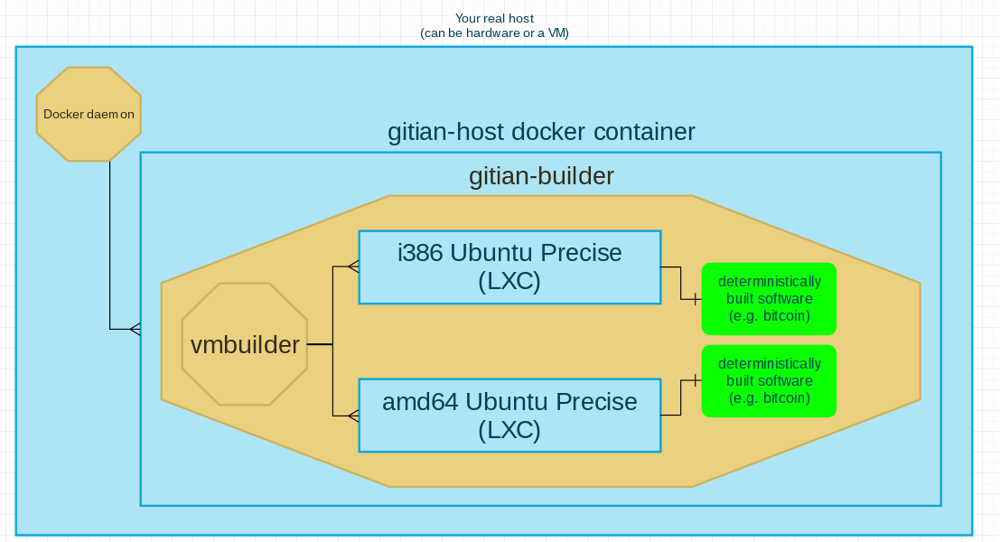

Gitian host docker container
============================

The provided [Dockerfile](http://docs.docker.io/reference/builder/) allows to generate a [gitian-builder](https://gitian.org/) host image, that can subsequently be used for reproducible builds using LXC VMs.

How this works:


Some of the discussions leading to the creation of this set of Dockerfiles/scripts are available on [this issue](https://github.com/devrandom/gitian-builder/issues/53).

Preamble
--------

It is **necessary** that before you using these scripts you read them and understand what they do.
Why? Because your goal is to create a gitian build (deterministic) that has not been tampered with, thus trust shall be correctly attributed during your process.

See also:
- https://gitian.org/
- https://en.wikipedia.org/wiki/Web_of_trust
- http://www.dwheeler.com/trusting-trust/
- https://www.debian.org/
- https://www.docker.io/
- http://www.ubuntu.com/

How to build the image
----------------------
Images have not been pushed images to my [Docker Registry](https://index.docker.io/) account, this is on purpose because even if generated images have my repository prefix ('gdm85/') you are supposed
to create them from scratch.

**NOTE:** you must have debootstrap on your real host to run this script successfully, and also make sure you have a keyring with APT keys, see also https://wiki.debian.org/SecureApt

First steps:
- run **scripts/build-wheezy.sh** to get a Debian Wheezy image debootstrapped from Debian repositories.
- run **scripts/create-gitian-host.sh**, this will simply build the Dockerfile that installs the few necessary dependencies inside the prepared image, plus generate a second image with the i386 and amd64 VMs (see [build-base-vms.sh](build-base-vms.sh)).

**NOTE:** when I say "run", what I really mean is "read the script, study it for your own learning purposes, then run it" ;)

After steps above you will have prepared a full gitian builder environment for deterministic builds.
The image that contains the VMs is called *gdm85/gitian-host-vms*; in future you can spawn containers with this image for new gitian-builder environments.

Example:
```
$ scripts/spawn-gitian-host.sh
You can now SSH into container 8a955ff5607b62d4c295745f27bbc38f2e8e011ea93053e641617d50ad2aa5a2:
ssh -o UserKnownHostsFile=/dev/null -o StrictHostKeyChecking=no debian@172.17.0.2
$ 
```
This will create a privileged running container that you can access with the SSH command displayed.

Derived images
--------------
A [bitcoin gitian host container](../gitian-bitcoin/host/README.md) is available.

Credits
-------
Thanks to jpetazzo for [dind](https://github.com/jpetazzo/dind) and to #docker & bitcoin-dev IRC users for the help&assistance!
